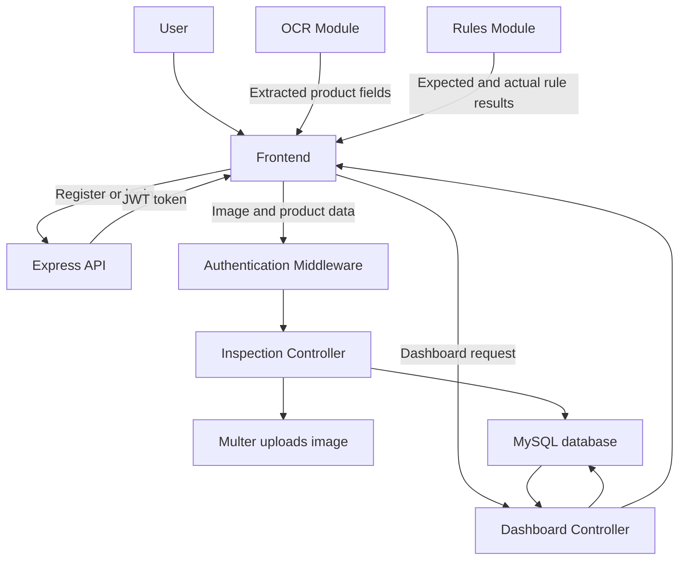

# Legal Metrology Compliance System

An inspection system for checking Indian consumer product packages against official legal-metrology rules.

The system allows a user to upload or capture a product-package image, store product information extracted by an OCR module, compare the information with rules supplied by a rules module, and view inspection results through a dashboard.

## Project Goals

- Capture product package images.
- Store inspection data securely.
- Receive OCR-extracted product information.
- Compare package information with official rules.
- Store passed, failed, and pending rule results.
- Display inspection statistics on a dashboard.
- Retrieve previous inspections for the logged-in user.

## Technology Stack

### Backend

- Node.js
- Express.js
- MySQL
- `mysql2`
- JWT authentication
- `bcryptjs` password hashing
- Multer image uploads
- `express-validator` request validation
- `dotenv` environment configuration
- CORS support

### Modules

- Frontend: captures images and displays the dashboard.
- Backend: provides APIs, authentication, upload handling, and database access.
- OCR module: extracts product and package information from an image.
- Rules module: provides official rules and compares expected and actual values.

## Project Structure

```text
Legal-Metrology-Compliance/
├── README.md
└── backend/
		├── config/
		│   └── db.js
		├── controllers/
		│   ├── authController.js
		│   ├── dashboardController.js
		│   └── inspectionController.js
		├── middleware/
		│   ├── authMiddleware.js
		│   ├── errorMiddleware.js
		│   └── uploadMiddleware.js
		├── routes/
		│   ├── authRoutes.js
		│   ├── dashboardRoutes.js
		│   └── inspectionRoutes.js
		├── uploads/
		├── app.js
		├── server.js
		├── schema.sql
		├── .env.example
		├── package.json
		└── README.md
```

## How the System Works



### Inspection Flow

1. The user registers or logs in.
2. The backend hashes the password during registration.
3. The backend returns a JWT after successful login.
4. The frontend sends the JWT in the `Authorization` header.
5. The user uploads a JPG, JPEG, or PNG package image.
6. Multer stores the image in `backend/uploads/` with a unique filename.
7. The OCR module returns fields such as product name, brand, batch number, and manufacturer.
8. The rules module returns rule results containing expected value, actual value, status, and remarks.
9. The backend stores the inspection and its rule results in MySQL.
10. The dashboard reads aggregate statistics and recent inspections from MySQL.

The backend does not perform OCR or invent rules. It provides JSON integration points so those modules can be developed independently.

## Database Design

The database is named `consumer_inspection_db` and contains:

### `users`

Stores user accounts. Passwords are stored only as bcrypt hashes.

### `inspections`

Stores the user who performed the inspection, image path, OCR product fields, inspection status, and creation time.

### `inspection_results`

Stores rule-by-rule comparison results connected to an inspection through a foreign key.

```text
users 1 ─────── many inspections 1 ─────── many inspection_results
```

The complete schema is available in [backend/schema.sql](backend/schema.sql).

## Setup Instructions

### Requirements

- Node.js 18 or newer
- npm
- MySQL 8 or newer

### 1. Install backend dependencies

Open a terminal in the `backend` directory:

```bash
cd backend
npm install
```

### 2. Create the MySQL database

Start MySQL and run:

```bash
mysql -u root -p < schema.sql
```

Alternatively, open `backend/schema.sql` in MySQL Workbench and execute it.

### 3. Configure environment variables

Copy the example file:

```bash
copy .env.example .env
```

Update `.env` with your local MySQL password and a strong JWT secret:

```env
PORT=5000
DB_HOST=localhost
DB_USER=root
DB_PASSWORD=your_mysql_password
DB_NAME=consumer_inspection_db
JWT_SECRET=use_a_long_random_secret
```

Do not commit `.env` or database credentials.

### 4. Start the backend

```bash
npm start
```

For development:

```bash
npm run dev
```

The API runs at `http://localhost:5000`.

## API Workflow

### Public endpoints

| Method | Endpoint | Purpose |
| --- | --- | --- |
| GET | `/api/health` | Check whether the backend is running |
| POST | `/api/auth/register` | Create a user account |
| POST | `/api/auth/login` | Authenticate and receive a JWT |

### Protected endpoints

These endpoints require:

```http
Authorization: Bearer <jwt-token>
```

| Method | Endpoint | Purpose |
| --- | --- | --- |
| POST | `/api/inspection` | Upload an image and create an inspection |
| GET | `/api/inspection` | List the logged-in user's inspections |
| GET | `/api/inspection/:id` | Retrieve one inspection and its results |
| DELETE | `/api/inspection/:id` | Delete an owned inspection |
| GET | `/api/dashboard` | Retrieve inspection statistics |

### Registration request

```json
{
	"name": "Asha Sharma",
	"email": "asha@example.com",
	"password": "secret123"
}
```

### Inspection request

`POST /api/inspection` uses `multipart/form-data`.

| Field | Type | Description |
| --- | --- | --- |
| `image` | File | JPG, JPEG, or PNG up to 5 MB |
| `product_name` | Text | Product name from OCR |
| `brand_name` | Text | Brand name from OCR |
| `batch_number` | Text | Batch or lot number |
| `manufacturer` | Text | Manufacturer name |
| `manufacturing_date` | Text | Date in `YYYY-MM-DD` format |
| `expiry_date` | Text | Date in `YYYY-MM-DD` format |
| `inspection_status` | Text | `pending`, `passed`, or `failed` |
| `results` | JSON text | Optional rules-module result array |

Example `results` value:

```json
[
	{
		"rule_id": "LM-PKG-001",
		"field_name": "manufacturer",
		"expected_value": "Declared on package",
		"actual_value": "Example Foods Pvt Ltd",
		"status": "passed",
		"remarks": "Manufacturer is present"
	}
]
```

## Response Format

Successful responses follow this format:

```json
{
	"success": true,
	"message": "Inspection created successfully",
	"data": {}
}
```

Error responses follow this format:

```json
{
	"success": false,
	"message": "Invalid inspection data"
}
```

## Postman Testing Order

1. Call `GET /api/health`.
2. Call `POST /api/auth/register` with JSON.
3. Call `POST /api/auth/login` and copy `data.token`.
4. Add `Authorization: Bearer <token>` to protected requests.
5. Create an inspection using `form-data` and attach an image to `image`.
6. List inspections using `GET /api/inspection?page=1&limit=10`.
7. Retrieve the created inspection with `GET /api/inspection/:id`.
8. Check counts with `GET /api/dashboard`.
9. Delete the inspection with `DELETE /api/inspection/:id`.
10. Test invalid login, missing tokens, invalid dates, unsupported files, oversized files, and access to another user's inspection.

## Security Features

- Passwords are hashed using bcryptjs.
- JWT secrets and database credentials are stored in `.env`.
- Protected routes require a valid JWT.
- SQL queries use parameterized values.
- Users can retrieve and delete only their own inspections.
- Uploads accept only JPG, JPEG, and PNG files.
- Upload size is limited to 5 MB.
- Passwords are never returned in API responses.
- Centralized error handling provides consistent JSON errors.

## Detailed Backend Documentation

For controller details, database setup, API examples, and integration notes, see [backend/README.md](backend/README.md).